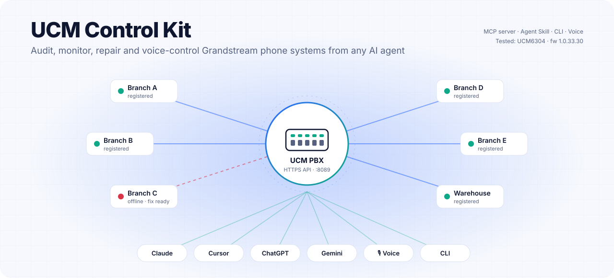
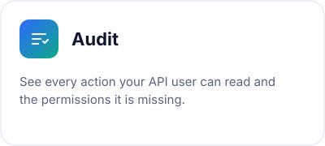
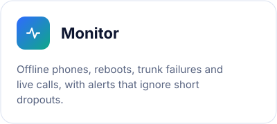
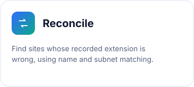
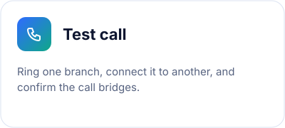
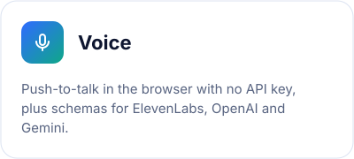
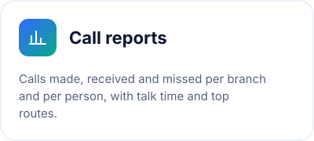
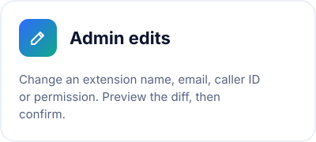
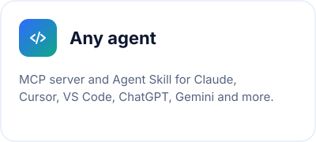
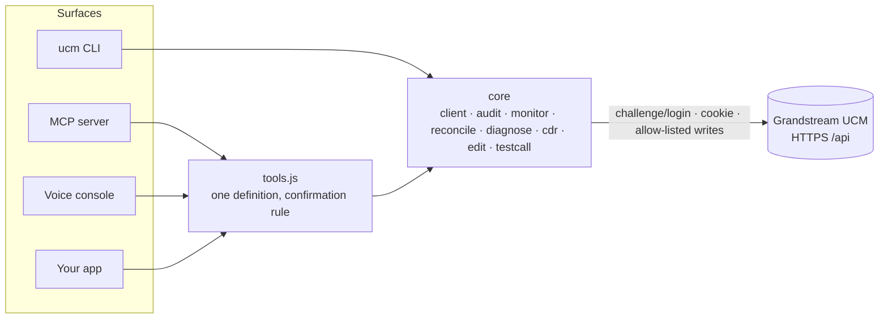

<div align="center">

<picture>
  <source media="(prefers-color-scheme: dark)" srcset="docs/assets/hero-dark.svg">
  
</picture>

**Audit, monitor, repair and voice-control Grandstream UCM phone systems from any AI agent.**

[](https://github.com/imodoiepale/ucm-control-kit/actions/workflows/ci.yml)
[](LICENSE)
[](docs/mcp.md)
[](skills/grandstream-ucm/SKILL.md)
[](docs/platforms.md)


[Quick start](#quick-start) · [What it does](#what-it-does) · [Use it from your AI tool](#use-it-from-your-ai-tool) · [Voice](#voice) · [Multi-site](#running-many-branches) · [Security](#security)

</div>

---

Organisations with many branches run one Grandstream UCM and dozens of desk phones. When a branch goes quiet, someone usually opens the UCM web UI, looks for the extension, and starts guessing.

This kit replaces that guessing with one set of tools. You can use them from a terminal, from any MCP-capable AI assistant, from an Agent Skill, or by voice.

- **Direct to the PBX.** It talks to the UCM's own HTTPS API. No cloud relay, no agents on the phones.
- **Safe by default.** Every tool that rings phones or changes settings needs an explicit confirmation and an allow-listed action.
- **Grounded in a real network.** The matching and diagnosis rules come from a live 44-branch retail network, and every published example is anonymised.

## What it does

<table>
<tr>
<td width="33%"><picture><source media="(prefers-color-scheme: dark)" srcset="docs/assets/card-audit-dark.svg"></picture></td>
<td width="33%"><picture><source media="(prefers-color-scheme: dark)" srcset="docs/assets/card-monitor-dark.svg"></picture></td>
<td width="33%"><picture><source media="(prefers-color-scheme: dark)" srcset="docs/assets/card-reconcile-dark.svg"></picture></td>
</tr>
<tr>
<td><picture><source media="(prefers-color-scheme: dark)" srcset="docs/assets/card-recover-dark.svg"></picture></td>
<td><picture><source media="(prefers-color-scheme: dark)" srcset="docs/assets/card-testcall-dark.svg"></picture></td>
<td><picture><source media="(prefers-color-scheme: dark)" srcset="docs/assets/card-voice-dark.svg"></picture></td>
</tr>
<tr>
<td><picture><source media="(prefers-color-scheme: dark)" srcset="docs/assets/card-calls-dark.svg"></picture></td>
<td><picture><source media="(prefers-color-scheme: dark)" srcset="docs/assets/card-edit-dark.svg"></picture></td>
<td><picture><source media="(prefers-color-scheme: dark)" srcset="docs/assets/card-mcp-dark.svg"></picture></td>
</tr>
</table>

| Tool | What you get | Changes things? |
|---|---|---|
| `pbx_status` | PBX up/down, firmware, registered vs offline phones, trunks, live calls | no |
| `list_extensions` | Every extension, with its IP, phone model and registration state | no |
| `extension_status` | One extension or branch, with a diagnosis and the smallest fix | no |
| `active_calls` | Calls in progress and ringing | no |
| `reconcile_sites` | Branches whose recorded extension is wrong, missing or ambiguous | no |
| `watch_changes` | Phones that went offline or came back, removed extensions, reboots | no |
| `call_report` | Calls per branch and person: made, received, missed, talk time, top routes | no |
| `test_call` | Rings one extension and bridges it to another | **rings phones**, needs confirmation |
| `update_extension` | Admin edit of an extension's name, email, caller ID or permission, with a preview | **yes**, preview first, then confirmation |

## Quick start

1. **Create an API user on the UCM.** Go to **Integrations → API Configuration → API Settings (New)**:
   - turn on **Enable API**;
   - add a user and tick the permissions you need;
   - **Save**.

   Turning on that user's IP allowlist is recommended.
2. **Run the CLI:**

```bash
export UCM_HOST=192.168.1.10:8089 UCM_USER=api_user   # password is prompted
npx @ucm-control-kit/cli status
npx @ucm-control-kit/cli audit              # which permissions are missing?
npx @ucm-control-kit/cli extensions --offline
npx @ucm-control-kit/cli reconcile --registry sites.json
npx @ucm-control-kit/cli calls --period week --registry sites.json --csv calls.csv
UCM_ALLOW_WRITES=dialExtension npx @ucm-control-kit/cli call 1001 1002
```

A site registry is plain JSON; see [`examples/sites.example.json`](examples/sites.example.json):

```json
[{ "id": "harbour", "name": "Harbour Road", "aliases": ["Harbour"], "extension": "1001", "subnet": "10.10.1.0/24" }]
```

No hardware to hand? `pnpm demo` starts a fake UCM plus the voice console. Every command works against it.

## Use it from your AI tool

The MCP server exposes the tools to any MCP client. For example, in Claude Code:

```bash
claude mcp add ucm -e UCM_HOST=192.168.1.10:8089 -e UCM_USER=api_user -e UCM_PASSWORD=... -- npx -y @ucm-control-kit/mcp
```

Other clients use the same command and variables. [docs/mcp.md](docs/mcp.md) has setup for each one:

| Client | Setup |
|---|---|
| Claude Code / Claude Desktop | `claude mcp add ...` or `claude_desktop_config.json` |
| Cursor | `.cursor/mcp.json` |
| VS Code (Copilot) | `.vscode/mcp.json` |
| Windsurf, Zed, Cline | their MCP settings |
| ChatGPT / OpenAI Agents SDK | MCP connector, or `exportTools('openai')` |
| Gemini CLI | `~/.gemini/settings.json` |

**Agent Skill.** [`skills/grandstream-ucm`](skills/grandstream-ucm/SKILL.md) teaches an agent the full audit → reconcile → monitor → diagnose → test workflow and the safety rules. It follows the open [Agent Skills](https://agentskills.io) format:

```bash
# Claude Code
cp -r skills/grandstream-ucm ~/.claude/skills/
```

Tools that read `AGENTS.md` (Codex, Copilot, Cursor, Jules and others) pick up the same guidance from [AGENTS.md](AGENTS.md).

**Library.**

```js
import { UcmClient, reconcile, tallyCalls, fetchCdr } from '@ucm-control-kit/core';
const ucm = new UcmClient({ host, user, password, allowWrites: ['dialExtension'] });
const offline = (await ucm.extensions()).filter((e) => !e.registered);
```

## Voice

```bash
UCM_ALLOW_WRITES=dialExtension npx @ucm-control-kit/voice   # then open http://127.0.0.1:8765
```

- **Push to talk.** Hold the button or the Space bar and say "which phones are offline", "how many calls did each branch make today", or "test call from Harbour Road to Hill Street".
- **No API key needed.** Speech recognition and speech output run in the browser.
- **Confirmation.** Anything that rings a phone or changes a setting waits for a spoken **"yes"**.

Using an LLM voice agent instead? Export the same tools for your platform:

```js
import { exportTools } from '@ucm-control-kit/core';
exportTools('elevenlabs'); exportTools('openai'); exportTools('gemini'); exportTools('anthropic');
```

[docs/voice.md](docs/voice.md) has the full setup.

## How it works



| Package | Purpose |
|---|---|
| [`@ucm-control-kit/core`](packages/core) | API client and logic. No runtime dependencies |
| [`@ucm-control-kit/cli`](packages/cli) | The `ucm` command |
| [`@ucm-control-kit/mcp`](packages/mcp) | MCP server over stdio |
| [`@ucm-control-kit/voice`](packages/voice) | Push-to-talk console and intent parser |

## Running many branches

These conventions make the automation reliable:

- **Display names:** the UCM display name should equal the branch name, so reconcile matches with full confidence.
- **Numbering and addressing:** give each region an extension range and each branch its own /24.
- **Nightly checks:** run `audit`, `reconcile` and a test call to each branch every night, and deal with the red items each morning.
- **Known-good settings:** keep a copy of each extension's last known-good settings, so recovery never starts from zero.

The full playbook covers onboarding wizard order, auto-heal levels and alert rules: [skills/grandstream-ucm/references/multi-site.md](skills/grandstream-ucm/references/multi-site.md).

## Platform support

| Model | Firmware | Status |
|---|---|---|
| **UCM6304** | **1.0.33.30** | Tested on hardware: system, extensions, trunks, routes, queues, IVR, paging, departments, channels, IPC |
| UCM6300 series (6301/6302/6308/6300A) | 1.0.x | Expected to work (same API), unverified |
| UCM6200 series | any | Unverified |

`getSIPAccount`, `updateSIPAccount`, `dialExtension` and `cdrapi` follow Grandstream's API guide. Run `ucm probe` to confirm them on your firmware. Please [report your model](.github/ISSUE_TEMPLATE/platform-report.yml) so this table can grow. Details: [docs/platforms.md](docs/platforms.md).

The legacy **HTTPS API Settings (Old)** page is deprecated by Grandstream and isn't used here.

## Security

- **Writes:** refused unless allow-listed (`UCM_ALLOW_WRITES`). `UCM_DRY_RUN=1` previews them instead.
- **Confirmation:** agent and voice tools need `confirm: true`, and admin edits show a diff first. Ambiguous names are refused, never guessed.
- **Out of scope:** there is no delete or password-change tool, on purpose.
- **Network:** the voice console binds to `127.0.0.1` by default.
- **Credentials:** keep the UCM password in environment variables or a secret store, never in chat.

See [SECURITY.md](SECURITY.md) to report a vulnerability.

## Contributing

Issues and PRs are welcome; see [CONTRIBUTING.md](CONTRIBUTING.md). Run the tests with:

```bash
pnpm install && pnpm test
```

They run against a built-in fake UCM, so no hardware is needed.

## License

[MIT](LICENSE). Grandstream and UCM are trademarks of Grandstream Networks, Inc. This project is not affiliated with or endorsed by Grandstream.
